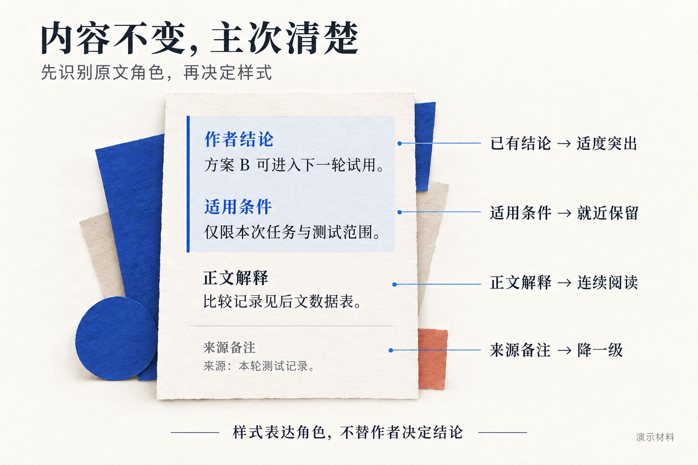
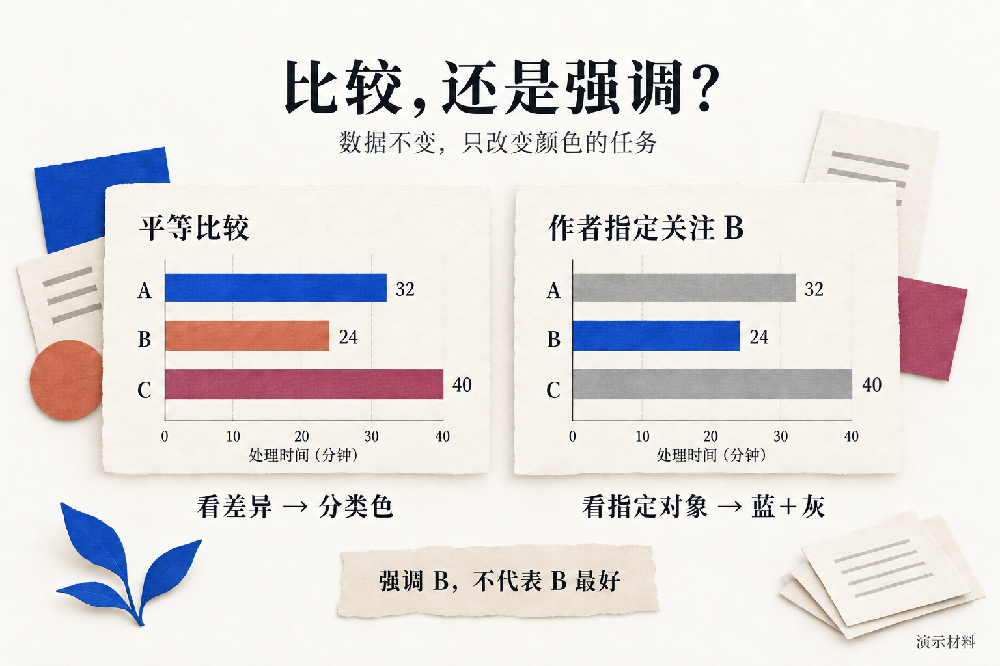
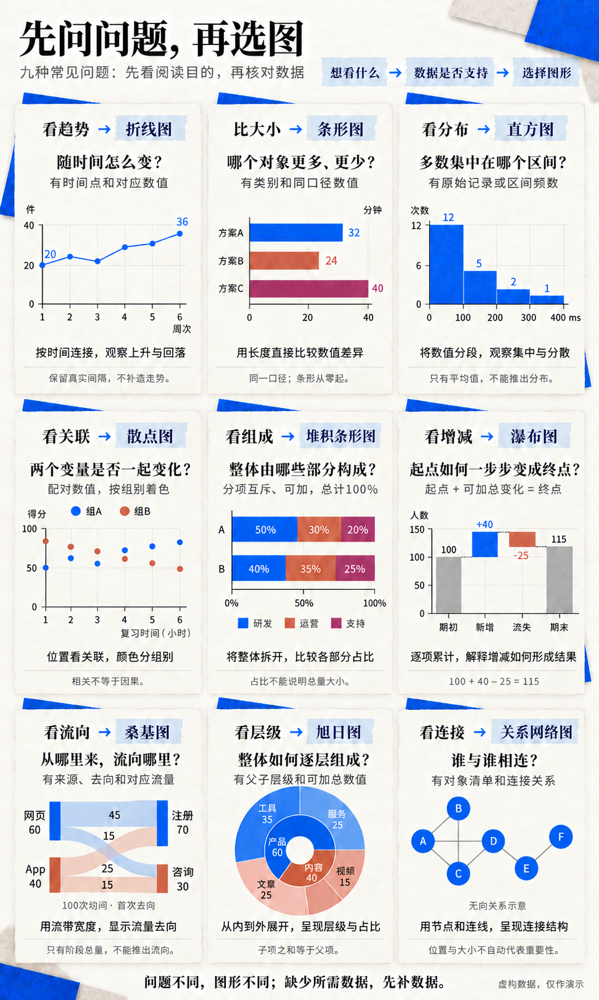
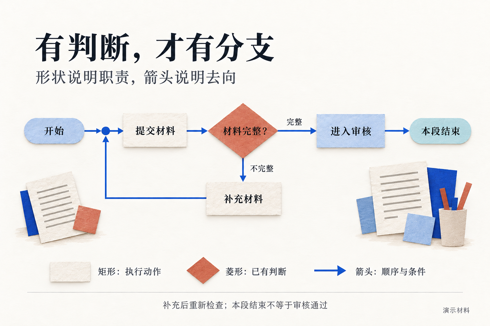

# HaosuNaki

**你决定内容和顺序，HaosuNaki 负责排版、样式与配图。**

## 是什么

HaosuNaki 是一套给 AI 使用的 UI 与视觉呈现 skill。它保留原稿文字、标题、章节和段落顺序，只处理排版、样式和配图。发现内容问题时单独提出建议，不自行改写、删减或补结论。

适合研究报告、方案比较、产品说明和机制解释。方法可以复用。默认沿用 HaosuNaki 主题，需要定制时可统一调整配色和字体；组件按内容选择。

## 框架是什么

| 四层 | 解决什么问题 |
|---|---|
| 决策流程 | 判断已有内容适合哪种视觉表达，不决定文章顺序 |
| 表达库 | 提供文字、表格、图形、交互与组合方式 |
| 视觉映射 | 用颜色、字号、对齐和留白表现主次与关系 |
| 验收规则 | 核对原文和顺序是否保留，再检查图形与使用效果 |

决策流程贯穿制作，调用表达库、应用样式，并按验收规则检查。四层共同工作。

## 怎么用


在支持 skill 的助手中启用 HaosuNaki，然后给出初稿：

```text
请用 HaosuNaki 为这份初稿排版和配图。
读者：[谁来读]
目的：[读完要知道什么、做什么]
输出：[HTML / PDF / GitHub 内容]
保留全部文字、标题、章节、段落顺序、数据和来源。
不改写、不删减、不补摘要或结论；内容问题单独列建议。

[附上初稿和数据]
```

首次使用见[安装与构建](docs/2026-10-06%20-%20安装与构建.md)。不需要提前把初稿排版好。

## 看 demo

[在线阅读使用说明](https://haosustrasbourg.github.io/haosunaki/manual.html) · [GitHub 文字版](docs/2026-10-06%20-%20使用说明.md)。先看三个具体例子：

1. **数据比较**：保留数据和作者结论，只处理表格与配图。
2. **条件流程**：判断、分支和起止怎样表达。
3. **图文组合**：保留文章顺序，用组件和间距呈现层级。

### 内容有主次，样式怎样区分？



**识别已有角色，再分配样式。** 结论在原位突出，正文方便连续阅读，来源备注降低一级；关键限制保持清楚。图中假设原稿先写结论，不表示 HaosuNaki 会把结论前移。

### 同一组数据，怎样比较与强调？



**平等比较用类别色，只看一个重点用蓝＋灰。** 强调对象由作者指定，不意味着工具推荐该对象。颜色首先表达业务含义与类别差异，再考虑品牌配色。

### 什么数据，用什么图？



**先确定想看什么，再核对数据是否支持。** 图形不按炫酷程度选择，各自解决不同问题：

| 想看什么 | 用什么图 | 至少需要什么 |
|---|---|---|
| 随时间怎么变化 | 折线图 | 时间点与对应数值 |
| 哪个更多、更少 | 条形图 | 类别与同口径数值 |
| 多数集中在哪里 | 直方图 | 原始数值或区间频数 |
| 两个变量是否关联 | 散点图 | 同一对象的两个配对数值；颜色可表示分组 |
| 整体由哪些部分组成 | 百分比堆叠条形图 | 互斥、可加的分项，每组总计 100% |
| 起点怎样变成终点 | 瀑布图 | 起点与逐项正负变化 |
| 从哪里来、流向哪里 | 桑基图 | 来源、去向与每条路径的流量 |
| 整体怎样逐层组成 | 旭日图 | 父子层级与可加总数值 |
| 谁与谁连接 | 关系网络图 | 对象清单与已知连接关系 |

桑基图看分流，旭日图看层级，网络图看连接。只有阶段总数，不能推导桑基图的流向；只有平均值，不能推导直方图的分布。散点图的颜色区分组别，关联本身也可以用单色观察。

### 有条件分支，怎样画清楚？



**动作用矩形，判断用菱形，分支写明条件。** 起点、终点和返回位置都要清楚。只呈现原稿已有逻辑，缺少条件时提醒作者，不自行补规则。

以上四图为 C 类教学插画，采用合成数据与虚构情景，用于说明选择方法；真实图表仍须按数据准确绘制。更多判断依据见[完整图文说明](https://haosustrasbourg.github.io/haosunaki/manual.html#visual-decisions)。

[阅读版 HTML 文件](docs/manual.html) · [图形演示 HTML](examples/demo.html)：下载后用浏览器打开，GitHub 文件页不执行交互。

附录：[打开设计参数样本 HTML](https://haosustrasbourg.github.io/haosunaki/design-tokens.html) · [下载 HTML](https://raw.githubusercontent.com/HaosuStrasbourg/haosunaki/main/docs/design-tokens.html)。沿用之前的完整样本，包含色样、字体、图表与 165 个参数。

## v1.0.0 核心能力

提供方法规范、[设计参数](assets/design-tokens.json)、离线 HTML 构建，以及条形图、折线图、基础机制图三个 SVG 生成器。[67 项官方参考索引](references/2026-10-04%20-%20已确认图族与复用索引.md)用于选型，不代表 67 个通用生成器。

运行要求为 Python 3.10+。复杂图形、插画生成和 PDF 导出需要相应工具支持，并单独验证。更多信息见[核心 skill](SKILL.md)与[发布说明](docs/2026-10-06%20-%20v1.0.0发布说明.md)。

## 许可

原创代码与文档采用 [MIT](LICENSE)。字体保留各自许可；Songti SC、PingFang SC、Georgia 只引用，不分发字体文件。插画来源与字体声明见[资源说明](docs/2026-10-06%20-%20第三方资源与许可.md)。
