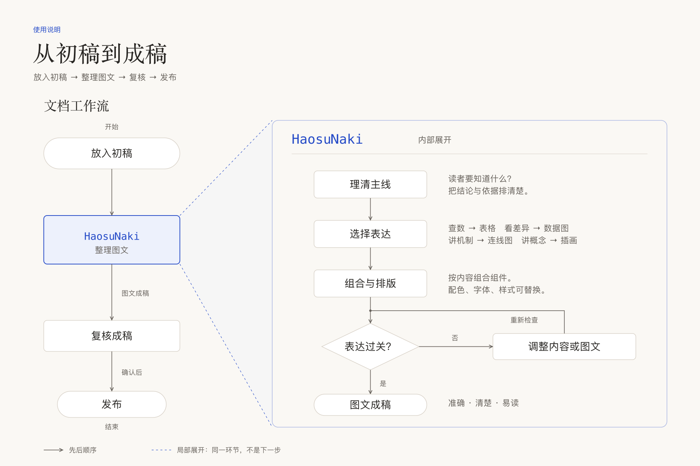

# HaosuNaki

把初稿整理成重点清楚、图文一致的成稿。

HaosuNaki 是一套面向研究报告、方案说明、PRD 和机制解释的图文方法与工具。先明确读者的问题和内容关系，再选择文字、表格、图形或交互，最后检查内容与实际呈现。默认主题可以替换，判断方法保持稳定。



## 四层架构，分别解决什么问题

| 职责层 | 通俗理解 | 主要判断 |
|---|---|---|
| 决策流程 | 想清楚怎么讲 | 读者要解决什么，证据是否够用，先讲什么、后讲什么 |
| 表达库 | 提供表达工具 | 用文字、表格、数据图、机制图还是插画；怎样组合 |
| 视觉映射 | 让关系看得出来 | 什么要突出，哪些属于同组，如何配色、对齐和留白 |
| 验收规则 | 检查是否讲对 | 内容是否准确，图文是否一致，实际输出是否可读、可用 |

四层共同完成一份文档。决策流程安排工作，过程中调用表达库、落实样式，并按验收规则检查。它们也不同于“基础样式 → 组件 → 组合 → 页面”这一成品组成关系。

[详细说明书](docs/2026-10-06%20-%20使用说明.md)用“三种 AI 方案如何比较”贯穿四层，逐步解释判断什么、为什么这样选、产出什么，以及发现问题后回到哪里修改。技术操作放在后半部。

## v1.0.0 提供什么

- **方法与规范**：选图、阅读组织、组件组合、配色、字体、机制图与验收规则。
- **统一视觉参数**：颜色、字体、字号、间距与线条集中在 [design-tokens.json](assets/design-tokens.json)，供页面和基础图形工具共用。
- **三个 SVG 生成器**：`bar()` 条形图、`line()` 折线图、`flow()` 显式坐标机制图。
- **离线 HTML 构建**：将正文、样式、所需脚本与开源字体合成单文件。
- **67 项官方参考 URL 索引**：按 10 类读者问题查找表达方式与使用边界；不代表 67 种图都有生成器。
- **插画方法与提示词**：A 细线编辑用于正文，C 纸感拼贴用于封面和大幅开篇；实际生图需要宿主提供图像生成工具。

本版不分发 67 份参考重绘 SVG 和 4 张插画参考 PNG。

## 先试用

运行要求：**Python 3.10+**。核心脚本只使用 Python 标准库；阅读 HTML 需要支持现代 HTML、CSS 和 JavaScript 的浏览器。

1. 下载完整仓库。
2. 将 [docs/manual.html](docs/manual.html) 或 [examples/demo.html](examples/demo.html) 下载到本地，用浏览器打开。GitHub 文件页和 README 不执行其中的 HTML / JavaScript。
3. 要重新生成演示，在仓库根目录运行：

```sh
python3 examples/build_demo.py
```

要在支持 skill 的助手中使用，把完整仓库目录手工放入个人 skill 目录，形成 `skills/haosunaki/SKILL.md`。若已有 `haosunaki`，先备份并比较差异，不直接覆盖。详见[使用说明](docs/2026-10-06%20-%20使用说明.md)。

```text
请用 HaosuNaki 整理这份初稿。
读者：[谁来读]
目的：[读完要知道什么、做什么]
输出：[HTML / PDF / GitHub README]
保留原意、数据和来源；缺失信息标注待补，不补造。

[粘贴初稿，或提供文件]
```

## 深入使用

- [使用说明](docs/2026-10-06%20-%20使用说明.md)：安装、构建、改主题与交付检查。
- [核心方法](SKILL.md) · [图形接口](references/2026-10-04%20-%20图形工具接口.md) · [参考索引](references/2026-10-04%20-%20已确认图族与复用索引.md)。
- [v1.0.0 发布说明](docs/2026-10-06%20-%20v1.0.0发布说明.md)。

运行基础检查：

```sh
python3 -m unittest discover -s tests -v
```

测试通过不等于新成品已完成视觉验收。新数据、长标签、交互、手机布局和 PDF 都需要按实际输出单独检查。

## 许可

原创代码与文档采用 [MIT License](LICENSE)。[fonts.css](assets/fonts.css) 内嵌的 IBM Plex Mono、JetBrains Mono 和 Lora 分别遵循各自的 SIL Open Font License 1.1，完整声明见[字体许可](assets/font-licenses.html)和[第三方资源说明](docs/2026-10-06%20-%20第三方资源与许可.md)。Songti SC、PingFang SC 和 Georgia 仅在 CSS 中引用，不随仓库分发。官方参考页面及其内容的权利归原权利人所有。
