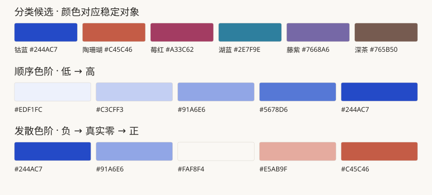

# HaosuNaki 使用说明

**你决定写什么、按什么顺序写；HaosuNaki 负责排版、样式和配图。**

## 一、HaosuNaki 是什么

HaosuNaki 是一套给 AI 使用的 **UI 与视觉呈现 skill**。把写好的初稿交给它，可以得到风格统一、层级清楚的 HTML、图表或文档页面。

HaosuNaki 保留原稿的文字、标题、章节、段落和先后顺序。它不改写文章，不提炼新结论，也不因为“结论先行”就把最后一段搬到开头。发现重复、缺漏或逻辑问题，可以单独提出建议，由作者决定是否修改。

它可以调整字号、行距、留白、对齐和颜色，选择合适的组件，并按已有数据或关系制作配图。默认使用 HaosuNaki 主题；需要定制时可统一更换配色和字体。

## 二、框架是什么

**四层都服务于呈现，不接管写作。**

| 四层 | 通俗地说 | 具体判断什么 |
|---|---|---|
| 决策流程 | 决定怎么呈现 | 原稿哪些部分适合正文、表格或配图？需要哪种组件？ |
| 表达库 | 提供现成的表达方式 | 用哪种表格、图形、引用块或提示框？组件怎样搭配？ |
| 视觉映射 | 统一视觉样式 | 已有标题、正文、结论怎样区分？字号、颜色、对齐和间距怎么设置？ |
| 验收规则 | 检查有没有改坏或漏掉 | 原文和顺序是否保留？数据是否一致？页面是否读得清、用得了？ |

实际使用：**接收原稿 → 识别已有结构 → 选择视觉表达 → 原位排版配图 → 核对原稿与成品。**

这里的“识别结构”是读懂作者已经写好的结构。结论放在哪里、哪一段先出现，继续由原稿决定。

| 原稿已有的内容 | 可以怎样呈现 |
|---|---|
| 连续说明与论证 | 保留正文，调整字号、行长和段落间距 |
| 同字段的数据表 | 对齐表头、文字与数值，必要时在旁边配图 |
| 数量差异或时间变化 | 用条形图、点图或折线图辅助阅读 |
| 步骤、条件和关系 | 按已有逻辑绘制流程图或机制图 |
| 主题或概念 | 配一张帮助理解的插画 |
| 已确认的公式和输入规则 | 制作相应的交互图，不另加判断规则 |

新增图表靠近对应段落，默认不替换原文。没有配图必要时，保留文字即可。

## 三、怎么用


启用 HaosuNaki 后，放入初稿，说明输出形式和需要处理的视觉问题：

```text
请用 HaosuNaki 为这份初稿排版和配图，输出 HTML。
保留全部文字、标题、章节和段落顺序，不改写、不删减，
不补摘要或新结论。已有表格请对齐，有合适的数据可以配图。
如果发现内容问题，请单独列出建议，不直接改稿。

[附上初稿和数据]
```

有数据就提供单位、时间范围和来源。原稿没有的信息，HaosuNaki 不负责补齐；需要补写标题、说明或结论时，应另行交给作者或写作任务处理。

你可以反馈：“表格对齐一些”“图例靠近图”“正文不要这么密”。如果要调整文章顺序或改写内容，请另行明确授权编辑范围。

HTML 适合阅读和交互；GitHub 适合文字与静态图；PDF 需要单独导出并检查分页。安装和构建方法见[操作附录](2026-10-06%20-%20安装与构建.md)。

## 四、细节 demo

### Demo 1 · 数据比较：呈现作者的材料，不替作者选方案

假设原稿已经按“数据表 → 成本条件 → 作者结论”的顺序写好。以下均为合成演示材料：

| 方案 | 成功次数 / 任务数 | 本次成功率 | 单次成本（演示单位） |
|---|---|---|---|
| A | 68 / 100 | 68% | 1.0 |
| B | 84 / 100 | 84% | 1.6 |
| C | 75 / 100 | 75% | 0.8 |

HaosuNaki 保留表格和 A、B、C 的顺序，对齐字段，并在数据表后配一张同数据图：


原稿接下来的条件和结论仍在原有位置，文字不变：

> 成本不能超过 1.2。在合格方案中，优先继续测试本次成功率更高的方案。

> 建议：优先继续测试 C。

**HaosuNaki 做的事**：表格对齐、数据配图、类别区分，以及已有结论的原位突出。

**作者决定的事**：比较标准、成本上限、推荐对象和文章顺序。若原稿没有推荐，HaosuNaki 不自行算出一条推荐写进去。

**核对**：数据、分母、条件和原文一致；图的长短反映数量，颜色不暗示未经作者说明的优劣。

### Demo 2 · 条件流程：把已有逻辑画清楚

原稿已经说明：“材料完整则进入图文整理；否则列出缺口，等待补充。”


HaosuNaki 用菱形表示已有判断，用“是／否”标注两条分支。普通节点白底，重点节点可以加色；连线尽量短、少弯折，正式稿去掉调试编号。

**核对**：条件、分支和起止范围与原稿一致。缺少失败分支时，可以提醒作者，但不能自行编一条补上。

### Demo 3 · 组合页面：顺序不变，层级更清楚


原稿按 **“背景说明 → 测试数据 → 条件限制 → 作者结论”** 展开，成稿也保持这个顺序。

HaosuNaki 给现有标题设置层级，为数据表对齐字段，让结论段在原位使用轻量提示样式。相邻且属于同一模块的内容靠近，不同模块用间距区分。手机减列、文字换行时，文章顺序仍然不变。

比较表、引用块、提示框是组件；多个组件可以搭配使用。组合样例提供样式参考，不要求文章为了套模板搬动段落。

**核对**：文字没有删改，段落没有移动，条件和限制没有隐藏。版面放不下就调整宽度、换行或分页，不靠缩写文章解决。

继续使用：[安装与构建](2026-10-06%20-%20安装与构建.md) · [完整演示 HTML](../examples/demo.html) · [选图判断树](../references/2026-10-04%20-%20选图判断树.md) · [主题参数](../references/2026-10-05%20-%20设计Tokens与参数维护.md) · [资源许可](2026-10-06%20-%20第三方资源与许可.md)

## 附录 设计 tokens

**Token 是一个有名字、有用途的设计参数。** 例如，把“页面底色”命名为 `surface.page`，把它的值设成纸白 `#FAF8F4`。页面需要底色时引用这个名字，以后调整主题就有明确的修改位置。

它与 AI 计算文本长度的 token 无关。**方法决定什么时候用什么，tokens 保存具体用什么颜色、字号和间距。** 换主题可以换参数，选图方法与“保留原文和顺序”的边界继续适用。

以下摘录自 2026-10-06 的 [design-tokens.json](../assets/design-tokens.json)。JSON 是共用参数的唯一来源；附录与色样是便于阅读的当前快照，参数变化后也要同步更新。下面展示常用项，不要求使用者记住全部名称。

### 1. 颜色：先分用途，再填色值

页面底色、节点底色、文字、强调和选中态分别命名。即使两个用途暂时使用相同颜色，也不把它们合并。以下项目的来源状态均为“已确认”，确认范围是已有规则或样例。


| 用途 | Token 名称 | 当前值 |
|---|---|---|
| 页面底色 | `surface.page` | `#FAF8F4` |
| 普通流程节点底色 | `surface.node` | `#FFFFFF` |
| 引用、指标、表头浅底 | `surface.neutral` | `#F4F1EC` |
| 提示框浅底 | `surface.callout` | `#F5F6FB` |
| 明确强调对象的浅底 | `surface.emphasis` | `#EDF1FC` |
| 主要文字 | `text.primary` | `#282623` |
| 辅助说明 | `text.secondary` | `#68635D` |
| 普通边界与分隔 | `border.default` | `#D7D0C6` |
| 链接与单一重点 | `accent.primary` | `#244AC7` |
| 交互选中 | `interaction.selected` | `#244AC7` |
| 代码区背景 | `code.surface` | `#282623` |
| 代码区文字 | `code.text` | `#FAF8F4` |


**基础色与用途色有区别。** `palette.cobalt` 保存钴蓝本身；`accent.primary`、`category.cobalt`、`interaction.selected` 当前都引用它。改钴蓝基础值会连带影响这些用途；只想改变重点颜色，应单独调整 `accent.primary`，保留类别和选中态的原有引用。

### 2. 图表颜色：类别、量值与状态分别处理



- **平等比较**：使用 `category.*` 的分类候选，并将颜色绑定到稳定对象。清单顺序不是强制分配顺序；需要明显区分时，不能硬用相近色。
- **突出一个对象**：重点用强调色，其余对象使用中性色；不要把这种处理套到所有平等比较图。
- **连续量值**：`scale.sequential.1` 到 `.5` 表示由低到高的顺序。发散色阶 `scale.diverging.1` 到 `.5` 需要有明确的中点含义；本套已确认方案的中点为真实零。不能因为数据有高低，就自动用正负色阶。
- **业务约定优先**：冷暖、涨跌、危险与正常等已有含义优先于品牌色。颜色还要配合名称、符号或线型，不能单靠颜色辨认。

任务状态另用 `status.*`。下表只用于本套审阅／任务语境，不直接外推成金融、风控或其他行业的状态定义。


| 状态 | 参数组 | 文字色 | 浅底色 |
|---|---|---|---|
| 待处理 | `status.pending.*` | `#68635D` | `#F4F1EC` |
| 进行中 | `status.running.*` | `#244AC7` | `#EDF1FC` |
| 成功 | `status.success.*` | `#24637C` | `#E8F0F3` |
| 提醒 | `status.warning.*` | `#974735` | `#F6EAE5` |
| 失败 | `status.failure.*` | `#A33C62` | `#F3E8ED` |


上述颜色与色阶来自已确认规则。选中仍然只表示选中，不自动表示执行成功。

### 3. 字体与字号：按角色分配

五类字体各管一种用途。字体栈按从前到后尝试可用字体，不保证每台设备显示相同字形。


| 用途 | Token 名称 | 首选字体 | 后续回退 |
|---|---|---|---|
| 中文标题 | `font.title.zh` | Songti SC | Noto Serif SC → Source Han Serif SC → serif |
| 中文正文 | `font.body.zh` | PingFang SC | Noto Sans SC → Source Han Sans SC → sans-serif |
| 英文标题 | `font.title.en` | IBM Plex Mono | monospace |
| 英文正文 | `font.body.en` | JetBrains Mono | monospace |
| 独立数字 | `font.number` | Georgia | Lora → serif |


中文、英文、混排、紧凑组件各有字体栈。只改 `font.base.zh-body` 不会自动替换混排与组件字体栈中的同名字体；更换时要核对实际使用的相关角色。Songti SC、PingFang SC、Georgia 只引用，不随包分发；其他字体及回退说明见[资源许可](2026-10-06%20-%20第三方资源与许可.md)。

下面的“字号 / 行高”以 px 表示。桌面是默认值；长文手机值来自宽度不超过 600px 的覆盖。这些属于已有阅读或组件样例采用值，仍需检查新内容的实际阅读效果。


| 用途 | 参数组 | 默认字号 / 行高 | 手机字号 / 行高 |
|---|---|---|---|
| 中文长文 | `type.body.zh.*` | 20 / 36 | 19 / 34 |
| 英文长文 | `type.body.en.*` | 19 / 32 | 18 / 30 |
| 紧凑组件正文 | `type.component.body.*` | 15 / 24 | 沿用默认值，按内容检查 |
| 组件小字说明 | `type.component.small.*` | 13 / 20 | 沿用默认值，按内容检查 |
| 状态标签 | `type.component.badge.*` | 14 / 20 | 沿用默认值，按内容检查 |
| 指标数字 | `type.component.metric.*` | 32 / 38 | 沿用默认值，按内容检查 |
| 代码正文 | `type.component.code.*` | 13 / 21 | 沿用默认值，按内容检查 |


字号和行高要一起调整。表格、代码、标签不必继承长文大字号，也不能把手机页面整体等比例缩小。各级标题并未全部抽成 tokens；原稿里的标题层级仍须按样式规则处理。

### 4. 间距与圆角：相关内容靠近，独立模块分开


常用间距档位：`8px`、`12px`、`16px`、`24px`、`32px`、`48px`、`64px`。章节间距 `space.section` 默认为 `64px`，手机覆盖为 `48px`。这些是可复用档位，不要求把所有组件内边距强行改成同一组倍数。


| 对象 | 参数组 | 上下 / 左右内边距 | 容器圆角 |
|---|---|---|---|
| 引用块 | `space.component.quote.*` / `radius.quote` | 17px / 20px | 5px |
| 指标组 | `space.component.metrics.*` / `radius.metrics` | 18px / 20px | 6px |
| 提示框 | `space.component.callout.*` / `radius.callout` | 17px / 18px | 6px |
| 表格单元 | `space.component.table.*` / `radius.table` | 11px / 13px | 6px |
| 状态标签 | `space.component.badge.*` / `radius.badge` | 5px / 10px | 4px |


表格内边距用于单元格，圆角用于表格容器。代码块圆角 `radius.code` 为 `7px`。标签紧随内容的间距 `space.status.inline` 为 `12px`，换行后间距 `space.status.wrap` 为 `8px`。以上为已确认组件采用值。


宽度不超过 400px 时，`compact` 覆盖会收紧引用、指标和提示框内边距。旧 `radius.legacy = 16px` 只供兼容入口使用，不能把它当作所有新组件的统一圆角。

### 5. 图形线条：网格退后，数据与关系清楚

“密集网格隔行区分主次，次网格更淡、更细”是已确认规则。**下表的具体数值是工具当前采用值（implementation），不等于每一项都单独完成了视觉定稿。**


| 用途 | 参数组 | 线宽 | 不透明度 |
|---|---|---|---|
| 主网格 | `stroke.grid.major.*` | 1px | 0.105 |
| 次网格 | `stroke.grid.minor.*` | 0.6px | 0.03 |
| 坐标基线 | `stroke.baseline.*` | 1px | 0.28 |
| 基础节点描边 | `stroke.node.width` | 1.5px | 未在此项单独定义 |
| 基础连线 | `stroke.edge.width` | 1.5px | 未在此项单独定义 |
| 图面连线 | `stroke.figure.edge.width` | 2px | 未在此项单独定义 |


不透明度范围是 0–1，数值越小越淡。节点、连线和网格有不同职责，不因“统一风格”而全部使用同样粗细。上述尺寸按实际画布与显示比例检查，不能只看参数表决定美感。

### 6. 想换成自己的风格，怎么改

可以直接告诉使用 HaosuNaki 的助手：

```text
请基于当前 tokens 做一个主题备选。
只把主强调色改为深蓝 #1E5AA8，保留类别色和业务状态色。
原文、段落顺序、数据与图表含义都不变。
先给我看效果，并说明哪些参数受到影响；确认后再采用。
```

操作顺序是：**选定用途 → 限定影响范围 → 修改参数与相关窄屏覆盖 → 校验 → 重新生成 → 查看实际效果。** 新选择仍处于试用时保留工作状态，不直接标成“已确认”。

手动维护时，在仓库根目录读取与检查：

```sh
python3 scripts/design_tokens.py --check
python3 scripts/design_tokens.py --mapping
```

尺寸写成数字并另带 `unit: "px"`，例如 20；不要写成字符串 `"20px"`。颜色使用六位色值，字体使用名称列表，别名写成完整的 `{palette.cobalt}`。倍数行高等无单位数值按原类型保存，例如主标题行高为 1.3。

修改后用原有构建入口重新生成 HTML 或 SVG，方法见[安装与构建](2026-10-06%20-%20安装与构建.md)。**已经导出的文件是快照，不会自动换肤。** 更换字体时同时检查回退、许可和长标签；更改尺寸时检查桌面、手机与需要交付的打印版本。

### 7. 哪些能改成参数，哪些仍靠判断

| 状态标记 | 含义 |
|---|---|
| `confirmed` | 已有规则或样例采用过；不表示所有新内容均已验证 |
| `implementation` | 工具当前实际使用值；不表示尚未实现，也不冒充独立视觉定稿 |
| `legacy` | 为旧入口保留的兼容值；不作为新组件的默认建议 |

Tokens 管可复用的外观参数。**用什么图、是否需要插画、文章顺序、流程条件和图形坐标，仍由原稿、表达规则与具体构图决定。** 当前并非全部标题层级、控件、历史模板常量都已参数化；定制页面也可能有明确的局部覆盖。

GitHub README 使用 GitHub 自身的页面样式，不会应用这套全部字体和 CSS。生成插画也不能保证逐像素符合色值。当前 JSON 是内部格式 `haosunaki.tokens.v1`，不宣称完整兼容 DTCG。

继续查看：[完整参数源](../assets/design-tokens.json) · [参数维护说明](../references/2026-10-05%20-%20设计Tokens与参数维护.md) · [设计规则](../references/2026-10-03%20-%20设计规范.md)
