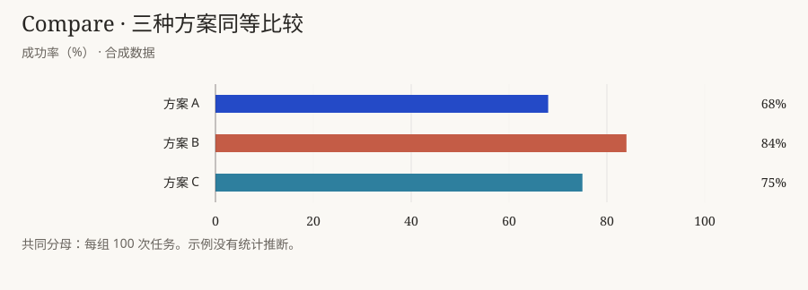
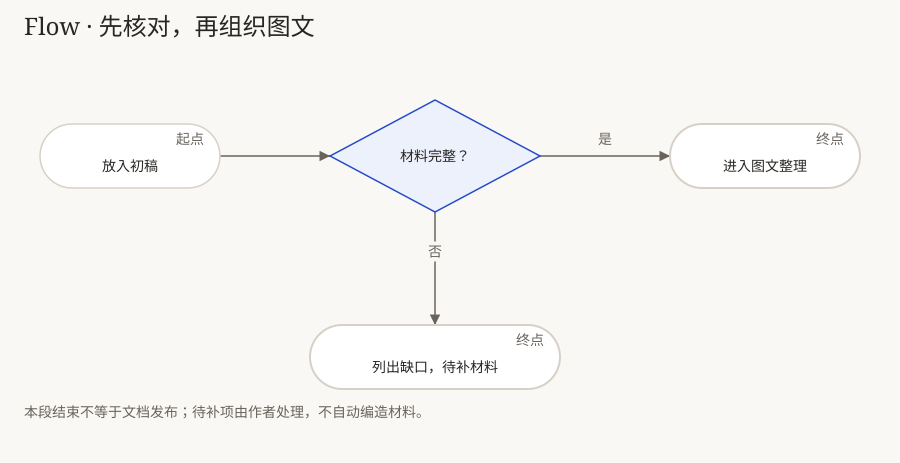

# HaosuNaki 使用说明

**你决定写什么、按什么顺序写；HaosuNaki 负责排版、样式和配图。**

## 一、HaosuNaki 是什么

HaosuNaki 是一套给 AI 使用的 **UI 与视觉呈现 skill**。把写好的初稿交给它，可以得到风格统一、层级清楚的 HTML、图表或文档页面。

HaosuNaki 保留原稿的文字、标题、章节、段落和先后顺序。它不改写文章，不提炼新结论，也不因为“结论先行”就把最后一段搬到开头。发现重复、缺漏或逻辑问题，可以单独提出建议，由作者决定是否修改。

它可以调整字号、行距、留白、对齐和颜色，选择合适的组件，并按已有数据或关系制作配图。默认使用 HaosuNaki 主题；需要定制时可统一更换配色和字体。

## 二、框架是什么

**四层都服务于呈现，不接管写作。**

| 四层 | 通俗地说 | 具体判断什么 |
|---|---|---|
| 决策流程 | 决定怎么呈现 | 原稿哪些部分适合正文、表格或配图？需要哪种组件？ |
| 表达库 | 提供现成的表达方式 | 用哪种表格、图形、引用块或提示框？组件怎样搭配？ |
| 视觉映射 | 统一视觉样式 | 已有标题、正文、结论怎样区分？字号、颜色、对齐和间距怎么设置？ |
| 验收规则 | 检查有没有改坏或漏掉 | 原文和顺序是否保留？数据是否一致？页面是否读得清、用得了？ |

实际使用：**接收原稿 → 识别已有结构 → 选择视觉表达 → 原位排版配图 → 核对原稿与成品。**

这里的“识别结构”是读懂作者已经写好的结构。结论放在哪里、哪一段先出现，继续由原稿决定。

| 原稿已有的内容 | 可以怎样呈现 |
|---|---|
| 连续说明与论证 | 保留正文，调整字号、行长和段落间距 |
| 同字段的数据表 | 对齐表头、文字与数值，必要时在旁边配图 |
| 数量差异或时间变化 | 用条形图、点图或折线图辅助阅读 |
| 步骤、条件和关系 | 按已有逻辑绘制流程图或机制图 |
| 主题或概念 | 配一张帮助理解的插画 |
| 已确认的公式和输入规则 | 制作相应的交互图，不另加判断规则 |

新增图表靠近对应段落，默认不替换原文。没有配图必要时，保留文字即可。

## 三、怎么用


启用 HaosuNaki 后，放入初稿，说明输出形式和需要处理的视觉问题：

```text
请用 HaosuNaki 为这份初稿排版和配图，输出 HTML。
保留全部文字、标题、章节和段落顺序，不改写、不删减，
不补摘要或新结论。已有表格请对齐，有合适的数据可以配图。
如果发现内容问题，请单独列出建议，不直接改稿。

[附上初稿和数据]
```

有数据就提供单位、时间范围和来源。原稿没有的信息，HaosuNaki 不负责补齐；需要补写标题、说明或结论时，应另行交给作者或写作任务处理。

你可以反馈：“表格对齐一些”“图例靠近图”“正文不要这么密”。如果要调整文章顺序或改写内容，请另行明确授权编辑范围。

HTML 适合阅读和交互；GitHub 适合文字与静态图；PDF 需要单独导出并检查分页。安装和构建方法见[操作附录](2026-10-06%20-%20安装与构建.md)。

## 四、细节 demo

### Demo 1 · 数据比较：呈现作者的材料，不替作者选方案

假设原稿已经按“数据表 → 成本条件 → 作者结论”的顺序写好。以下均为合成演示材料：

| 方案 | 成功次数 / 任务数 | 本次成功率 | 单次成本（演示单位） |
|---|---|---|---|
| A | 68 / 100 | 68% | 1.0 |
| B | 84 / 100 | 84% | 1.6 |
| C | 75 / 100 | 75% | 0.8 |

HaosuNaki 保留表格和 A、B、C 的顺序，对齐字段，并在数据表后配一张同数据图：



原稿接下来的条件和结论仍在原有位置，文字不变：

> 成本不能超过 1.2。在合格方案中，优先继续测试本次成功率更高的方案。

> 建议：优先继续测试 C。

**HaosuNaki 做的事**：表格对齐、数据配图、类别区分，以及已有结论的原位突出。

**作者决定的事**：比较标准、成本上限、推荐对象和文章顺序。若原稿没有推荐，HaosuNaki 不自行算出一条推荐写进去。

**核对**：数据、分母、条件和原文一致；图的长短反映数量，颜色不暗示未经作者说明的优劣。

### Demo 2 · 条件流程：把已有逻辑画清楚

原稿已经说明：“材料完整则进入图文整理；否则列出缺口，等待补充。”



HaosuNaki 用菱形表示已有判断，用“是／否”标注两条分支。普通节点白底，重点节点可以加色；连线尽量短、少弯折，正式稿去掉调试编号。

**核对**：条件、分支和起止范围与原稿一致。缺少失败分支时，可以提醒作者，但不能自行编一条补上。

### Demo 3 · 组合页面：顺序不变，层级更清楚


原稿按 **“背景说明 → 测试数据 → 条件限制 → 作者结论”** 展开，成稿也保持这个顺序。

HaosuNaki 给现有标题设置层级，为数据表对齐字段，让结论段在原位使用轻量提示样式。相邻且属于同一模块的内容靠近，不同模块用间距区分。手机减列、文字换行时，文章顺序仍然不变。

比较表、引用块、提示框是组件；多个组件可以搭配使用。组合样例提供样式参考，不要求文章为了套模板搬动段落。

**核对**：文字没有删改，段落没有移动，条件和限制没有隐藏。版面放不下就调整宽度、换行或分页，不靠缩写文章解决。

继续使用：[安装与构建](2026-10-06%20-%20安装与构建.md) · [完整演示 HTML](../examples/demo.html) · [选图判断树](../references/2026-10-04%20-%20选图判断树.md) · [主题参数](../references/2026-10-05%20-%20设计Tokens与参数维护.md) · [资源许可](2026-10-06%20-%20第三方资源与许可.md)
